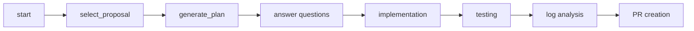

# Rubber-ducky (Workflow Orchestrator MCP)

**Repo:** https://github.com/soad666p/Rubber_Ducky
MCP server that can be used from any MCP-compatible client (for example Gemini CLI, Claude Desktop, or other LLM tools). It exposes workflow tools (Jira, Confluence, GitHub, Splunk, SonarQube, etc.) and guides through proposals, planning, implementation, testing, log analysis, and PR creation.

## MCP client configuration

Each client stores MCP server configuration in a different place. For Gemini CLI, configuration is read from:

- **`~/.gemini/settings.json`**

Add or edit the `mcpServers` section there. The **gemini-md-mcp** entry should point at this repo’s server (see [Setup](#setup) below). A copyable template with placeholders is in **`gemini-settings.example.json`** — copy it to your client config and replace placeholders using the token instructions below.

If you are using a client other than Gemini, use the equivalent MCP server configuration location and schema for that client, and point it to this same server entrypoint.

have a look at the PRD

## Setup

```bash
npm install
npm run build
```

To run the MCP server directly (e.g. for debugging):

```bash
npm run dev
```

In `~/.gemini/settings.json`, ensure **gemini-md-mcp** points to your clone, for example:

```json
"gemini-md-mcp": {
  "command": "node",
  "args": [
    "--loader",
    "ts-node/esm",
    "/path/to/your/Rubber_Ducky/src/server.ts"
  ],
  "cwd": "/path/to/your/Rubber_Ducky"
}
```

Use your actual project path instead of `/path/to/your/Rubber_Ducky`.

---

## Getting API tokens for MCPs

The MCPs used by this workflow need API tokens. Configure them under `mcpServers` in your MCP client config for each server. Below is how to obtain each token and where it goes.

### Jira / Atlassian (mcp-atlassian)

- **What you need:** `JIRA_API_TOKEN` and optionally `CONFLUENCE_API_TOKEN` (same token can be used for both).
- **How to get it:**
  1. Go to [Atlassian API tokens](https://id.atlassian.com/manage-profile/security/api-tokens).
  2. Click **Create API token** (or **Create API token with scopes** if available).
  3. Name it (e.g. “Gemini MCP”), set expiration, choose Jira and/or Confluence, set scopes.
  4. Copy the token and store it securely.
- **Where it goes:** In `mcpServers["mcp-atlassian"].env`:
  - `JIRA_API_TOKEN`
  - `CONFLUENCE_API_TOKEN` (if using Confluence)
  Use your Atlassian email for `JIRA_USERNAME` / `CONFLUENCE_USERNAME`.

### Confluence (confluence-cloud-mcp)

- **What you need:** `CONFLUENCE_API_TOKEN` (same as above).
- **How to get it:** Same as [Jira / Atlassian](#jira--atlassian-mcp-atlassian) — create an API token at the same Atlassian page and use it for Confluence.
- **Where it goes:** In `mcpServers["confluence"].env`:
  - `CONFLUENCE_API_TOKEN`
  - `CONFLUENCE_EMAIL` (your Atlassian email)
  - `CONFLUENCE_DOMAIN` (e.g. `yourcompany.jira.com`).

### Splunk (splunk-mcp-server)

- **What you need:** A Splunk authentication token (Bearer token) for your Splunk Cloud/Enterprise instance.
- **How to get it:**
  - **Splunk Cloud:** [Manage authentication tokens](https://help.splunk.com/en/splunk-cloud-platform/administer/manage-users-and-security/authenticate-into-the-splunk-platform-with-tokens/create-authentication-tokens) (Splunk Cloud docs).
  - **Splunk Enterprise:** [Create authentication tokens](https://docs.splunk.com/Documentation/Splunk/latest/Security/CreateAuthTokens).
  Create a token, then use it as a Bearer token in API requests.
- **Where it goes:** In `mcpServers["splunk-mcp-server"].args`, the remote MCP URL is passed to `mcp-remote`; you need to pass the token, e.g. via `--header "Authorization: Bearer YOUR_SPLUNK_TOKEN"`. Replace `YOUR_SPLUNK_TOKEN` with the token you created.

### GitHub (GitHub Copilot MCP)

- **What you need:** A GitHub Personal Access Token (PAT) with scopes that allow the operations you need (e.g. repo read, pull requests).
- **How to get it:**
  1. GitHub → **Settings** → **Developer settings** → **Personal access tokens** (or [github.com/settings/tokens](https://github.com/settings/tokens)).
  2. **Generate new token** (classic or fine-grained). Grant at least the repo permissions needed for the MCP (e.g. read repo, read/write PRs).
  3. Copy the token once; it won’t be shown again.
- **Where it goes:** In `mcpServers["github"].headers`:
  - `Authorization: "Bearer ghp_xxxxxxxx"` (replace with your PAT).

### SonarQube / SonarCloud (sonarqube)

- **What you need:** A user token from your SonarQube or SonarCloud instance.
- **How to get it:**
  - **SonarCloud:** Log in at [sonarcloud.io](https://sonarcloud.io) → **My Account** → **Security** → **Generate Tokens**. Name it and copy the token.
  - **SonarQube:** Log in → **My Account** → **Security** → **Generate Tokens** (or ask an admin to create one for you).
- **Where it goes:** In `mcpServers["sonarqube"].env`:
  - `SONARQUBE_TOKEN` — the token you generated
  - `SONARQUBE_URL` — e.g. `https://sonarcloud.io` or your SonarQube URL
  - `SONARQUBE_ORG` — for SonarCloud, your organization key (e.g. `your-org`)

---

## Workflow

The orchestrator drives a structured flow:

- **Proposals:** Present multiple implementation options for a change.
- **Plan (Conductor-style):** After choosing a proposal, produce a spec and phased plan. Artifacts are written under `conductor/tracks/<sessionId>/` (e.g. `spec.md`, `plan.md`) so the repo can be used with [Conductor](https://github.com/gemini-cli-extensions/conductor) in Gemini CLI.
- **Implementation:** Guide code changes.
- **Testing:** Run and interpret tests.
- **Log analysis:** Inspect logs for debugging and verification (e2e, etc.).
- **PR creation:** Help create Pull Requests.

Flow: **start** → **select_proposal** → **generate_plan** → answer questions → implementation → testing → log analysis → PR creation.

### Workflow diagram



## License

See repository license file.
